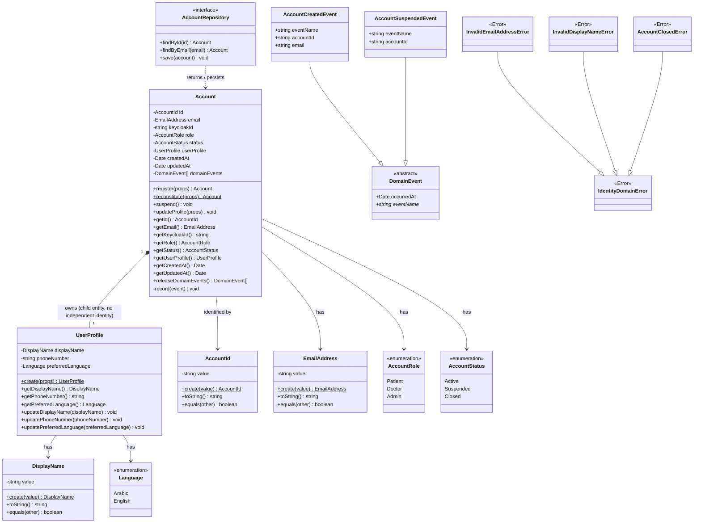
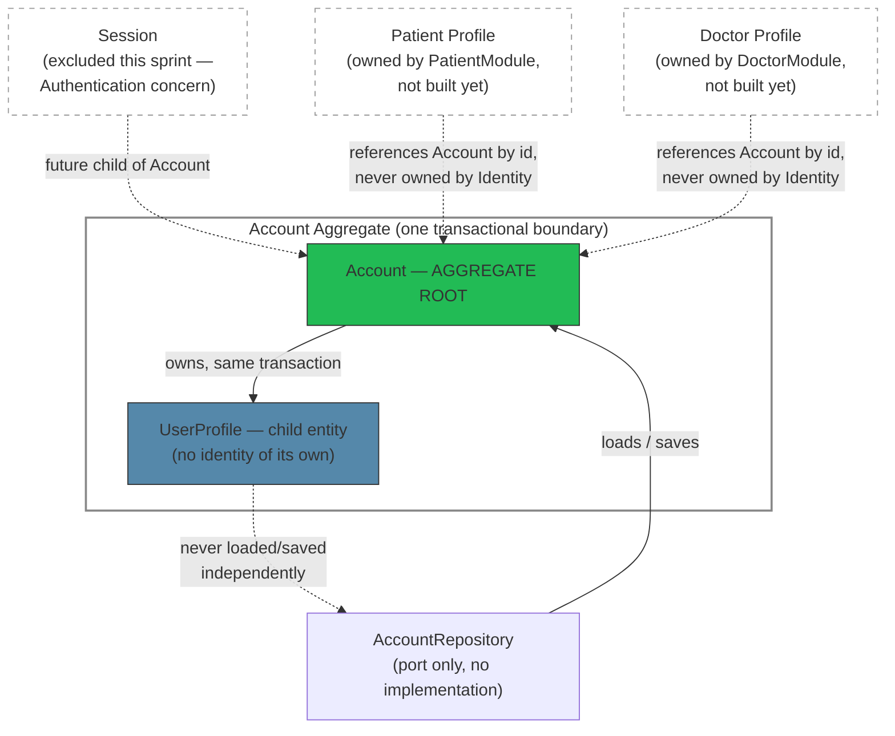

Identity Domain — Architecture Documentation

Source: `apps/backend/src/modules/identity/domain/` (Sprint 1.1A, as refined in commit `436a1fa`). Purely descriptive of what exists today — this document does not introduce any new design decisions.

1. Class Diagram

2. Aggregate Diagram

3. Invariants

- `EmailAddress` must match a valid email shape; normalized (trimmed, lowercased) at construction — violation raises `InvalidEmailAddressError`.
- `AccountId` must be a well-formed UUID — violation raises `IdentityDomainError` (no dedicated subclass exists for this one).
- `DisplayName` is required, non-empty, and bounded to `MAX_DISPLAY_NAME_LENGTH` (100 characters, `domain/constants/identity.constants.ts`) — violations raise `InvalidDisplayNameError`.
- `Account.keycloakId` is required at registration and immutable thereafter — enforced in `Account.register()`, violation raises `IdentityDomainError`. No Keycloak calls are made; this is an opaque external-identity reference only.
- `Account.role` has no public setter — it is fixed at registration. Role elevation (e.g. after doctor verification) is a future event-driven reaction owned by a later sprint, not implemented here.
- `Account.status` starts at `Active`. `suspend()` is idempotent (calling it while already `Suspended` is a no-op) and throws `AccountClosedError` if the account is `Closed` — `Closed` is a terminal state with no path back.
- `UserProfile` cannot exist independently of an `Account` — it is only ever constructed via `Account.register()`, and only ever mutated via `Account.updateProfile()`, never directly.
- `UserProfile.preferredLanguage` defaults to `Language.Arabic` when not specified, per the platform's Arabic-first localization principle.
- `UserProfile.phoneNumber` is stored as a plain, unvalidated string this sprint — international phone parsing/formatting is explicitly out of scope (Sprint 1.1A).

4. Domain Events

| Event | Raised by | Payload | Notes |
|---|---|---|---|
| `AccountCreatedEvent` (`identity.account.created`) | `Account.register()` | `accountId`, `email` | Raised exactly once, at registration. |
| `AccountSuspendedEvent` (`identity.account.suspended`) | `Account.suspend()` | `accountId` | Raised only on the `Active → Suspended` transition; not raised on an idempotent repeat call. |

Both extend the reusable `DomainEvent` abstract base (`eventName` + `occurredAt`), which is deliberately not Identity-specific — every future bounded context (Trust, Clinical, Consultation, etc.) is expected to extend the same base rather than invent its own event shape. Events are recorded on the aggregate and drained via `Account.releaseDomainEvents()`; no event bus, publisher, or subscriber exists yet — dispatching them after a successful write is future application-layer work.

5. Why UserProfile Is Part of the Account Aggregate

`UserProfile` is not a separate aggregate because it has no independent lifecycle, no independent consistency boundary, and no reason to be loaded, saved, or transacted separately from `Account`:

- **No independent identity.** `UserProfile` has no ID of its own (a deliberate architect decision) — nothing in the system ever needs to reference a `UserProfile` by ID independent of its owning `Account`. An aggregate boundary exists to protect a consistency rule; there is no rule here that spans multiple `UserProfile`s or that requires addressing one directly.
- **Always created and destroyed together.** A `UserProfile` is constructed only inside `Account.register()` and ceases to be meaningful the moment its `Account` does. This 1:1, always-exists relationship is the textbook case for a child entity rather than a peer aggregate.
- **One repository, one transaction.** Per `docs/10-backend-architecture.md` §5 ("one repository per aggregate root, never a generic repository for everything"), splitting `UserProfile` into its own aggregate would require its own repository and would reintroduce exactly the cross-aggregate transactional coupling DDD aggregate boundaries exist to prevent — e.g. updating a display name would risk being a separate transaction from the `Account` state it logically belongs to.
- **Consistent with how `Session` is documented.** `docs/10-backend-architecture.md` already describes `Session` as "a child of Account, no independent aggregate root." `UserProfile` follows the same shape: real entity, real behavior, but subordinate to `Account`'s consistency boundary.
- **Deliberately distinct from Patient/Doctor Profile.** Patient Profile and Doctor Profile *are* documented as their own aggregate roots, owned by their own (not-yet-built) modules — because they carry substantial, independently-evolving domain content (health context, professional portfolio) with their own lifecycles. `UserProfile` carries none of that; it is cross-role, low-content, and structurally simple, which is precisely why it stays inside Identity rather than becoming a third profile-shaped module.

6. Future Extension Points

**Sessions**
`Session` is documented as an `Account`-owned child entity but is entirely excluded from this sprint. When the Authentication sprint begins, it will most likely be added as a second child entity within the same `Account` aggregate (parallel to `UserProfile`), with its own lifecycle (`Created at login → expires/revoked`) — raising a `SessionStarted` event, per `docs/10-backend-architecture.md`'s documented event list. Whether `Session` ends up needing its own repository (given it has real, independent identity and a much higher write/expiry churn rate than `Account` itself) is an open question worth revisiting explicitly at that time rather than assuming today's "one repository per aggregate" rule applies unchanged.

**Keycloak**
`Account.keycloakId` already exists as an opaque string reference — the domain model was deliberately built to not need any changes when Keycloak integration lands. The future work is entirely in the infrastructure layer: an adapter that calls Keycloak for credential verification/token issuance and populates/validates `keycloakId`, per the architecture decision that "IdentityModule delegates actual credential verification/session issuance to Keycloak conceptually" (`docs/10-backend-architecture.md` §10). No domain entity, value object, or invariant here should need to change for that integration to land.

**Roles**
`AccountRole` is currently a fixed-at-registration enum with no elevation path implemented. `docs/10-backend-architecture.md`'s documented sequence ("`DoctorVerified` → ... → IdentityModule (subscriber) elevates role capabilities") implies a future domain method (e.g. `Account.elevateRole(newRole)`) reacting to an event published by TrustModule once doctor verification completes. That method does not exist yet — deliberately, since implementing it now would mean building a cross-module business workflow, which is out of this sprint's scope.

**Permissions**
Per `docs/10-backend-architecture.md` §2, permission evaluation is explicitly owned by a separate `AuthModule` ("distinct from Identity — authorization, not authentication"), which reads `Account.role` plus TrustModule's verification status through a stateless `can(actor, action, resource)` contract. Identity's job stops at exposing a role; it is not expected to ever own permission/policy logic itself. The extension point is therefore in a different module entirely, not inside this one — worth stating explicitly so a future contributor doesn't default to bolting permission checks onto `Account`.
